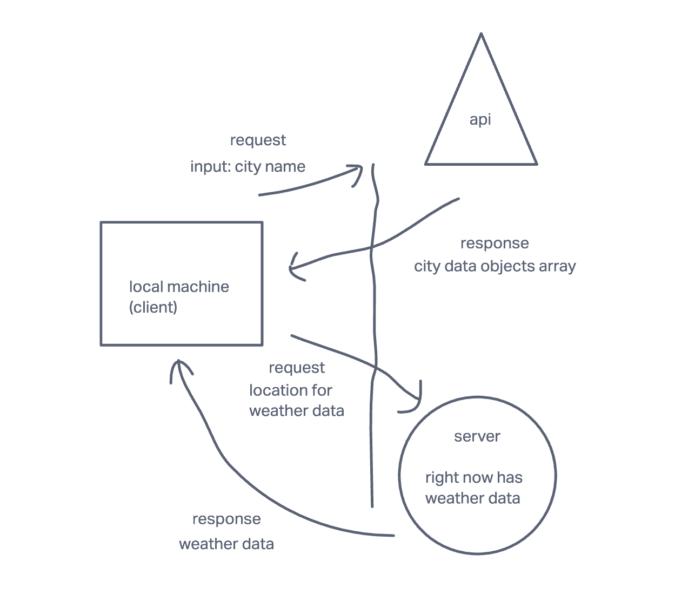
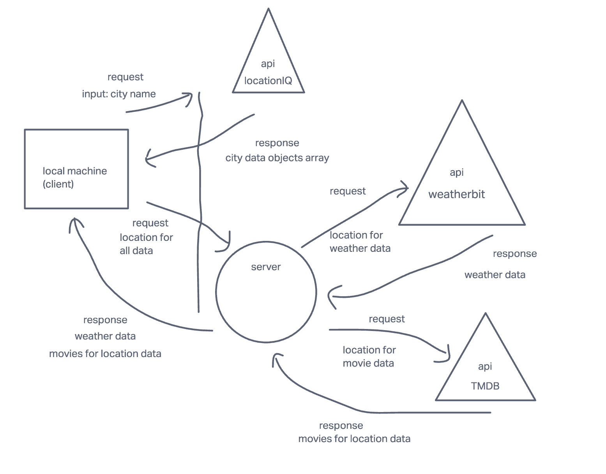

# City Explorer - Server

**Author**: Nate Brown

**Version**: 1.0.2

## Overview

Server to provide weather data to City Explorer app

## Getting Started

<!-- What are the steps that a user must take in order to build this app on their own machine and get it running? -->

## Architecture

Server built with Node.js Express

<!-- Provide a detailed description of the application design. What technologies (languages, libraries, etc) you're using, and any other relevant design information. -->

## Change Log

2225 07 Mar 2023 - v.1.0.0 - First server commit
2308 07 Mar 2023 - v.1.0.1 - Server is listening!
0009 09 Mar 2023 - v.1.0.2 - Server returns forecast array

## Credit and Collaborations

Special thanks to: Kam Watts, Mohammed Abubakar, Ryan Bagan

## Time Estimates

For each of the lab features, make an estimate of the time it will take you to complete the feature, and record your start and finish times for that feature:

Name of feature: Set up server repository
Estimate of time needed to complete: 1 hour
Start time: 2200 07 Mar 2023
Finish time: 2309 07 Mar 2023
Actual time needed to complete: 1 hour

Name of feature: Weather (placeholder)
Estimate of time needed to complete: 30 min
Start time: 2309 07 Mar 2023
Finish time: 0009 09 Mar 2023
Actual time needed to complete: 3 hours

Name of feature: Errors
Estimate of time needed to complete: 30 min
Start time: NA
Finish time: NA
Actual time needed to complete: NA

WRRC diagram incorporating LocationIQ API and Express server containing placeholder weather data

WRRC diagram incorporating LocationIQ API and Express server containing weather and movie data from APIs

